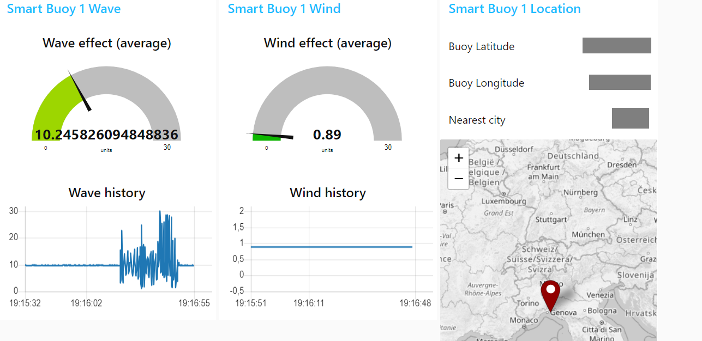

# Smart Buoy

Smart Buoy is an IoT system to measure the wave height and compare it with weather forecasts.
A buoy, equipped with a smartphone, is deployed at sea. It streams data about its location and the accelleration to which it is subject due to the waves.
A PC records the data anc compares it with the weather forecasts.

The project is under development.

## Applications
If a data analysis is performed, a relationship can be established between waves monitored by the IMU and wave height provided by the forecast.
If the measured data provide values inconsistent with the established relationship, it means that the natural waves have been altered (e.g. due to powerboat passage effects) or that the forecast is not correct.

## Requirements
- a smartphone phone with IMU and GPS, that acts as signal recording and transmission system
- the [Sensor Logger](https://www.tszheichoi.com/sensorlogger) (on the phone) with the payed features for using MQTT
- a PC sunning Windows or Linux
- [node-red](https://nodered.org/) with the following additional nodes:
  - node-red-dashboard
  - node-red-contrib-web-worldmap
  - node-red-contrib-moving-average
- A free account on [HiveMQ](https://www.hivemq.com/)
- A free account on [OpenWeatherMap](https://openweathermap.org/)

## How do you run it

### On the smartphone running Sensor Logger
- Edit the settings for "Data Streaming" according to [this picture](sensorlogger_data_streaming.jpg) with your URL (EXCLUDING the port), the username and the password obtained by HiveMQ.
- Edit the setting for "Sampling Frequency" according to [this picture](sensorlogger_sampling_frequency.jpg).
- Hit "Start Recording"

### On the PC running node-red
- On HiveMQ, create a free account and obtain a cluster serverless ([see image](account_hivemq_1.png)), copy its TLS MQTT URL ([see image](account_hivemq_2.png)), and create credentials ([see image](account_hivemq_3.png)).
- On OpenWeatherMap, create a free account and obtain an API key ([see image](account_openweathermap.png)).
- In [node-red](http://127.0.0.1:1880/), import the [flow provided](flow.json)
- Setup the "MQTT stream" node setup to add a new MQTT server with your URL (including the port), the username and the password obtained by HiveMQ (see [Picture 1](nodered_mqttin_hivemq_1.png), [Picture 2](nodered_mqttin_hivemq_2.png), [Picture 3](nodered_mqttin_hivemq_3.png) and [Picture 4](nodered_mqttin_hivemq_4.png). Be careful that everything is configured as shown in the pictures, download if needed a new TLS CA certificate [isrgrootx1.pem](isrgrootx1.pem).
- Setup the "Smart Buoy in the map" node with your API key.
- [Open the UI](http://127.0.0.1:1880/ui) and see the magic happen!

## What happens when you run it
The data from the IMU and the GPS on the phone are streamed by Sensor Logger to node-red through the MQTT broker HyveMQ.
The message, which contains multiple sensor readings (GPS and IMU operate with different frequencies) is transformed into a JavaScript Object. Only the last readings are taken from the message.
If there is a GPS reading, it is used to display the location on the map and obtain from OpenWeatherMap the name of the nearest city and the wind speed (waves are not available).
The IMU reading is used to calculate the intentity of the acceleration vector.
The wind speed and the acceleration vector are displayed in charts, and their average over the last reads is displayed on gauges.
